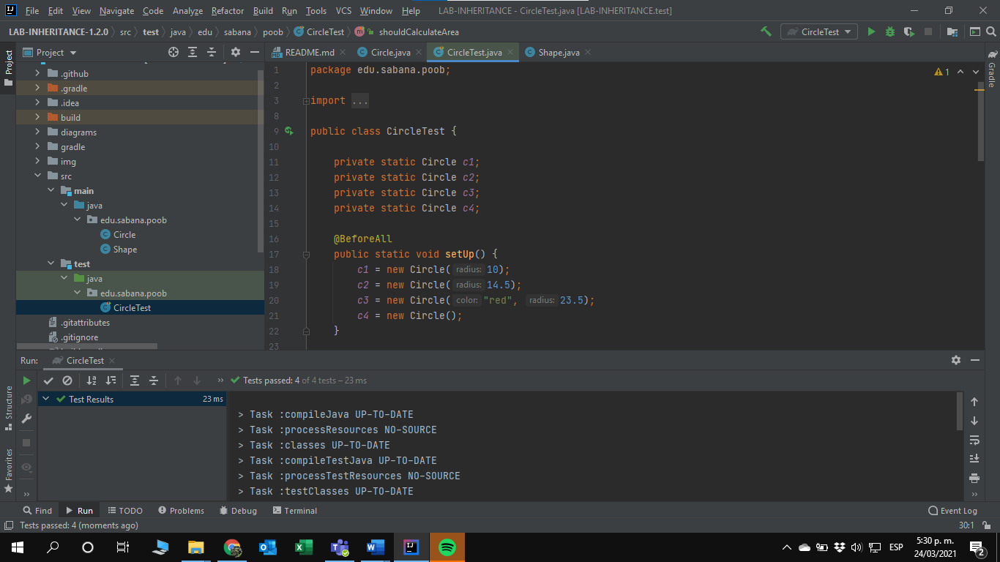
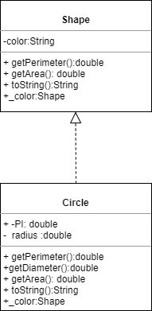
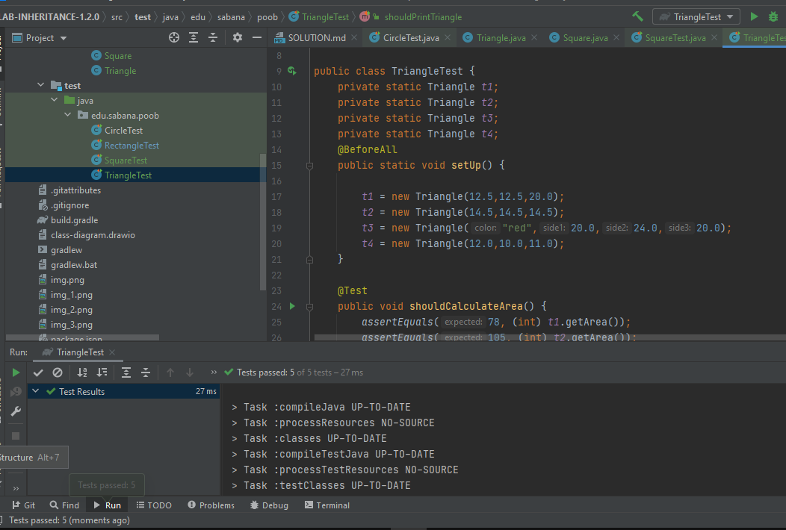
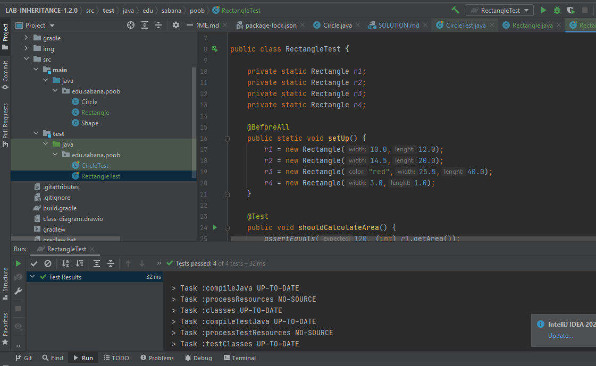
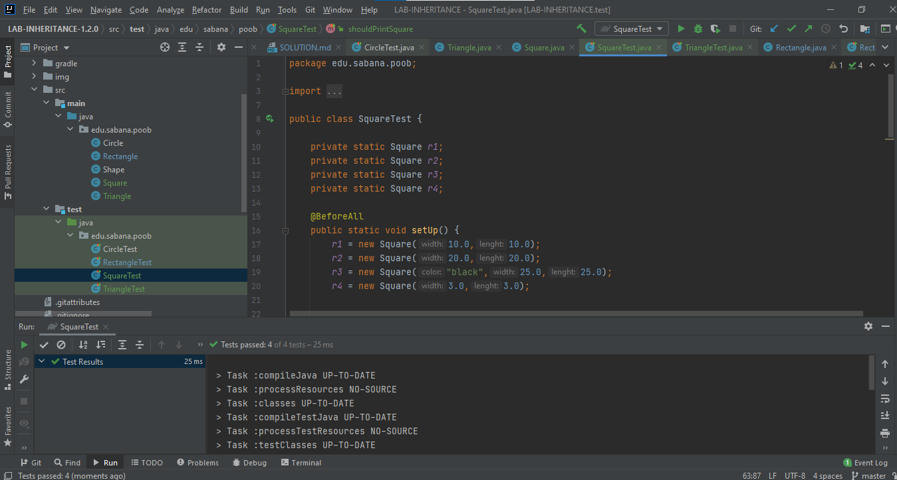

# SOLUTIONS

## PARTE 1

Evidencias de las pruebas realizadas 

Diseño

## PARTE 2

Evidencias de las pruebas del Triangulo

Evidencias de las pruebas del Rectangulo

Evidencias de las pruebas del cuadrado

<<<<<<< HEAD

=======
##Parte 
#Evidencias de las pruebas realizadas 

>>>>>>> 506eaebe3532d149864ec8a6307a54efa997f2ec
