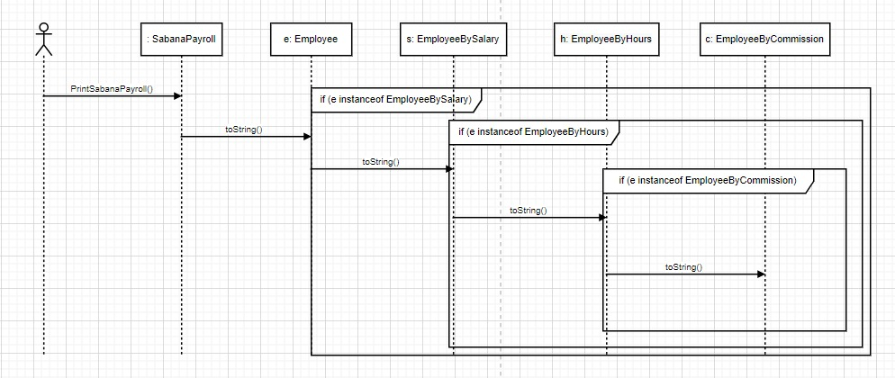

# SOLUTIONS

## PARTE 1

Evidencias de las pruebas realizadas 

Diseño

## PARTE 2

Evidencias de las pruebas del Triangulo

Evidencias de las pruebas del Rectangulo

Evidencias de las pruebas del cuadrado

Diseño

## PARTE 3

## PARTE 4 
Evidencias de las pruebas 

Diagramas

